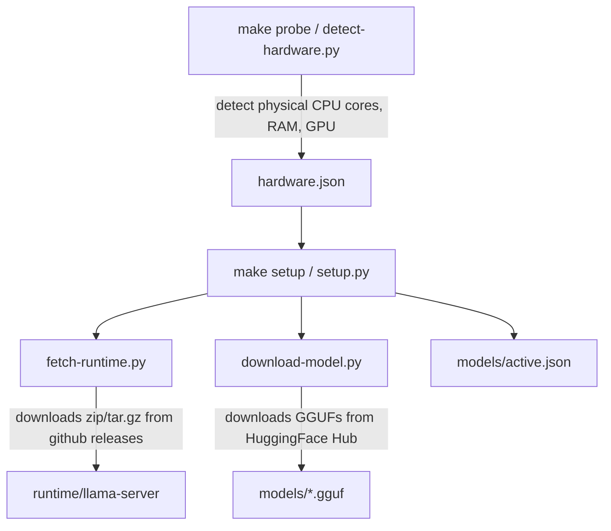
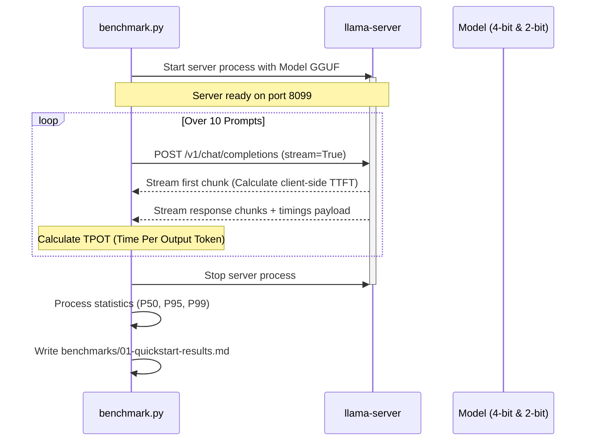
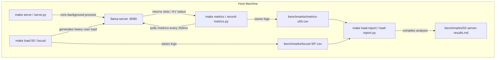

# Lab Codebase Documentation: Model Serving & Inference Optimization

Welcome to the Day 20 Lab workspace. This document provides a developer-focused, architectural overview of the codebase, detailing its structure, components, data flows, and configuration knobs.

---

## 1. Directory Structure

Below is the directory tree mapping the files and components of this workspace:

```
├── lib/
│   └── labkit.py               # Core utility layer (model registry, path resolution, server control)
├── labs/
│   ├── 00-setup/
│   │   ├── MANUAL-DOWNLOAD.md  # Instructions for manually downloading models when rate-limited
│   │   ├── README.md           # Phase 0 setup documentation
│   │   ├── bootstrap.ps1       # Windows bootstrapping script to setup PowerShell policies
│   │   ├── detect-hardware.py  # Probes host CPU, RAM, OS, GPU and writes hardware.json
│   │   ├── download-model.py   # HuggingFace downloader for Gemma 4 / Qwen3.5 GGUF weights
│   │   ├── fetch-runtime.py    # Downloads prebuilt llama.cpp binaries based on hardware.json
│   │   └── setup.py            # Orchestrator integrating detection, runtime download, and model download
│   ├── 01-measure/
│   │   ├── README.md           # Latency measurement guide
│   │   ├── benchmark.py        # Measures TTFT, TPOT, and latency percentiles across quantizations
│   │   └── tune.py             # Sweeps thread count parameters using llama-bench to optimize speed
│   ├── 02-serve/
│   │   ├── README.md           # Model serving, load testing, and batching guide
│   │   ├── serve.py            # Starts llama-server as a background process with Prometheus /metrics
│   │   ├── smoke-test.py       # Validates server completions endpoint and reads metric endpoints
│   │   ├── load-test.py        # Locust load-testing script simulating parallel user requests
│   │   ├── record-metrics.py   # Continually samples Prometheus busy slots / decode metrics during load
│   │   └── load-report.py      # Parses Locust and recorded metric logs to build saturation reports
│   └── 03-integrate/
│       ├── README.md           # Integration and RAG pipeline instructions
│       └── pipeline.py         # Implements a Retrieval-Augmented Generation (RAG) pipeline against llama-server
├── bonus/                      # Optional extra points track
│   ├── sweeps/
│   │   ├── batch-size-sweep.py # Sweeps --batch-size / --ubatch-size configurations
│   │   ├── ctx-len-sweep.py    # Sweeps context lengths vs prefill cost curves
│   │   ├── gpu-offload-sweep.py# Sweeps GPU offload (-ngl) performance details
│   │   └── quant-sweep.py      # Sweeps all quantization levels (IQ2 to Q8)
│   ├── mlx/
│   │   └── compare-mlx-vs-llama-cpp.py # Latency comparison of Apple Metal MLX vs. llama.cpp on macOS
│   ├── serving-regimes/
│   │   ├── embedding-serving.py # Simple sentence embedding client demonstration
│   │   └── semantic-cache-demo.py # Semantic caching engine wrapper around the served API
│   ├── CHALLENGES.md           # Lists bonus challenges C1-C10
│   ├── README.md               # Bonus guide
│   └── compare-builds.py       # Latency comparison between prebuilt and source-compiled llama.cpp
├── scripts/
│   └── verify.py               # Pre-submission verification script verifying outputs and reflection completion
├── submission/
│   ├── REFLECTION.md           # Student reflection template answering analysis questions
│   └── screenshots/            # Directory containing student execution screenshots
├── Makefile                    # Makefile target automation for macOS / Linux
├── lab.ps1                     # PowerShell equivalent script automating all Makefile targets on Windows
├── pyproject.toml              # Project dependency definition
└── requirements.txt            # Python dependencies (huggingface_hub, httpx, locust, numpy)
```

---

## 2. Core Plumbing: `lib/labkit.py`

[`lib/labkit.py`](file:///d:/Studying/Codelabs%20at%20VinUni/Day20/TRACK2_DAY20_2A202601889_DinhHoaiNam/lib/labkit.py) acts as the shared utility layer. Every other script in the lab imports it. It encapsulates:

*   **Model Registry**: Defined in `MODELS`, it registers details for:
    *   **Gemma 4 E2B (`gemma4-e2b`)**: The default model, downloading UD-Q4_K_XL and UD-Q2_K_XL quants.
    *   **Qwen3.5 0.8B (`qwen35-0.8b`)**: The lightweight alternative for lower RAM machines.
*   **Path Resolution**: Helper functions like `repo_root()`, `hardware_json()`, `active_json()`, and `runtime_dir()` map out directories regardless of where the script was executed.
*   **System Drivers & Accelerator Detection**:
    *   `any_gpu(hw)`: Checks if any accelerator backends are available.
    *   `visible_devices(binary)`: Queries the actual `llama-server` binary using `--list-devices` to check if it can *successfully* load libraries and run on the host GPU.
    *   `n_gpu_layers(hw)`: Returns GPU offload layer parameters (defaults to `99` if GPU is visible, `0` otherwise).
*   **Subprocess Execution & Lifecycle**:
    *   `run_cmd(...)`: Executes shell/powershell commands and streams/buffers output.
    *   `start_server(...)`: A context manager launching `llama-server` in the background with selected thread limits, models, ports, and parameters, ensuring it is cleanly shut down when exiting.
*   **Environment Configuration**: Supports environment variables:
    *   `LAB_MODEL`: Overrides the default model.
    *   `LAB_SERVER_PORT`/`LAB_EMBED_PORT`: Custom port bindings.
    *   `LAB_N_THREADS`: CPU thread count overrides.
    *   `LAB_N_GPU_LAYERS`: Explicit number of layers to offload to GPU.

---

## 3. Component Details & Workflows

### 3.1 Setup (Phase 0)

1.  [`labs/00-setup/detect-hardware.py`](file:///d:/Studying/Codelabs%20at%20VinUni/Day20/TRACK2_DAY20_2A202601889_DinhHoaiNam/labs/00-setup/detect-hardware.py): Probes CPU layout, physical vs logical cores, RAM size, OS brand, and graphics card support (CUDA, ROCm, Vulkan, Metal) using platform queries and shell scripts (e.g. `nvidia-smi` on Windows, `sysctl` on macOS, `/proc/cpuinfo` on Linux). Generates `hardware.json`.
2.  [`labs/00-setup/download-model.py`](file:///d:/Studying/Codelabs%20at%20VinUni/Day20/TRACK2_DAY20_2A202601889_DinhHoaiNam/labs/00-setup/download-model.py): Installs HuggingFace downloads for the active model's primary (4-bit) and compare (2-bit) quantizations into the `models/` folder. Can also fetch specular speculative decoding MTP heads (`--with-mtp`).
3.  [`labs/00-setup/fetch-runtime.py`](file:///d:/Studying/Codelabs%20at%20VinUni/Day20/TRACK2_DAY20_2A202601889_DinhHoaiNam/labs/00-setup/fetch-runtime.py): Fetches prebuilt, matching release binary ZIP/tarballs of `llama.cpp` (build `b10488`) from GitHub Releases matching the host architecture/accelerator choice (e.g., CUDA v12.4 on Windows, Vulkan on Linux, Metal on Apple Silicon). Unpacks binaries to `runtime/`.
4.  [`labs/00-setup/setup.py`](file:///d:/Studying/Codelabs%20at%20VinUni/Day20/TRACK2_DAY20_2A202601889_DinhHoaiNam/labs/00-setup/setup.py): The main setup orchestrator. Prepares virtual environments, triggers hardware detection, fetches binaries, downloads models, and writes `models/active.json`.



---

### 3.2 Measurement & Tuning (Phase 1)

1.  [`labs/01-measure/benchmark.py`](file:///d:/Studying/Codelabs%20at%20VinUni/Day20/TRACK2_DAY20_2A202601889_DinhHoaiNam/labs/01-measure/benchmark.py): Measures generation latency. It launches `llama-server` internally, runs a series of ten prompts through HTTP POST, reads token statistics reported by `llama.cpp` client-side, records client-side Time to First Token (TTFT) and Token Generation Speed (TPOT), shuts down the server, and repeats for the comparison (2-bit) quant. Generates `benchmarks/01-quickstart-results.md`.
2.  [`labs/01-measure/tune.py`](file:///d:/Studying/Codelabs%20at%20VinUni/Day20/TRACK2_DAY20_2A202601889_DinhHoaiNam/labs/01-measure/tune.py): Measures thread limits on performance. It runs `llama-bench` (from the prebuilt runtime) in multiple sweeps, testing different thread counts (from 1 physical thread up to logical core ceilings). Generates `benchmarks/01-tuning-tg128.md` capturing the optimal CPU threading footprint for your machine.



---

### 3.3 Serving & Load Testing (Phase 2)

1.  [`labs/02-serve/serve.py`](file:///d:/Studying/Codelabs%20at%20VinUni/Day20/TRACK2_DAY20_2A202601889_DinhHoaiNam/labs/02-serve/serve.py): Launches `llama-server` in standalone mode on port 8080 (or `LAB_SERVER_PORT`). Exposes an OpenAI-compatible interface and a `/metrics` Prometheus endpoint.
2.  [`labs/02-serve/smoke-test.py`](file:///d:/Studying/Codelabs%20at%20VinUni/Day20/TRACK2_DAY20_2A202601889_DinhHoaiNam/labs/02-serve/smoke-test.py): Checks server health. Sends a basic prompt and fetches Prometheus metrics to verify `llacpp:tokens_predicted_total` has incremented above zero.
3.  [`labs/02-serve/load-test.py`](file:///d:/Studying/Codelabs%20at%20VinUni/Day20/TRACK2_DAY20_2A202601889_DinhHoaiNam/labs/02-serve/load-test.py): A locust-based HTTP user generator that sends concurrent chats with streaming tokens. Triggered by running:
    *   `make load-10` (Locust triggers 10 virtual users, running for 60s)
    *   `make load-50` (Locust triggers 50 virtual users, running for 60s)
4.  [`labs/02-serve/record-metrics.py`](file:///d:/Studying/Codelabs%20at%20VinUni/Day20/TRACK2_DAY20_2A202601889_DinhHoaiNam/labs/02-serve/record-metrics.py): Starts as a companion script during load tests. It samples `llama-server`'s `/metrics` every few hundred milliseconds, tracking slots, KV cache occupancy, active decodes, and queue queueing latencies. Writes logs to `benchmarks/metrics-*.csv`.
5.  [`labs/02-serve/load-report.py`](file:///d:/Studying/Codelabs%20at%20VinUni/Day20/TRACK2_DAY20_2A202601889_DinhHoaiNam/labs/02-serve/load-report.py): Reads the Locust run metrics logs and the polled server metrics, processes concurrency performance, and outputs `benchmarks/02-server-results.md`.



---

### 3.4 Integration & RAG (Phase 3)

*   [`labs/03-integrate/pipeline.py`](file:///d:/Studying/Codelabs%20at%20VinUni/Day20/TRACK2_DAY20_2A202601889_DinhHoaiNam/labs/03-integrate/pipeline.py): Runs queries against the active server. Performs a Retrieve-Embed-Generate workflow.
    *   Retrieves context matching query strings (using mock dictionaries or real cosine similarities via a local `/embeddings` server).
    *   Assembles the system/user instruction prompt containing retrieved documents context.
    *   Queries `llama-server` to generate answers.
    *   Outputs timings for each phase (embed, retrieve, decode) to audit bottleneck boundaries.

---

### 3.5 Bonus Sweeps & Features

The `/bonus` folder houses experiments that extend optimization insights:
*   **Hardware Build Comparison**:
    *   `make build-llama`: Clones the matching `llama.cpp` version and compiles it locally, using specific platform instruction extensions (AVX2, AVX512, CUDA, ARM Neon, Metal, etc.).
    *   `compare-builds.py`: Side-by-side performance profiling of prebuilt release binary vs. compiled native build to verify native instruction set gains.
*   **Parameters Sweep Sweeps**:
    *   [`bonus/sweeps/quant-sweep.py`](file:///d:/Studying/Codelabs%20at%20VinUni/Day20/TRACK2_DAY20_2A202601889_DinhHoaiNam/bonus/sweeps/quant-sweep.py): Sweep quant weights from dynamic 2-bit up to 8-bit to map the lossy precision trade-off curve.
    *   [`bonus/sweeps/ctx-len-sweep.py`](file:///d:/Studying/Codelabs%20at%20VinUni/Day20/TRACK2_DAY20_2A202601889_DinhHoaiNam/bonus/sweeps/ctx-len-sweep.py): Evaluates prefill/TTFT processing bottlenecks as prompt context sizes scale.
    *   [`bonus/sweeps/batch-size-sweep.py`](file:///d:/Studying/Codelabs%20at%20VinUni/Day20/TRACK2_DAY20_2A202601889_DinhHoaiNam/bonus/sweeps/batch-size-sweep.py): Measures performance delta when scaling `--batch-size` and `--ubatch-size`.
    *   [`bonus/sweeps/gpu-offload-sweep.py`](file:///d:/Studying/Codelabs%20at%20VinUni/Day20/TRACK2_DAY20_2A202601889_DinhHoaiNam/bonus/sweeps/gpu-offload-sweep.py): Sweeps layer offloading ratios to profile CPU/GPU memory boundary overhead.
*   **Regime Experiments**:
    *   [`bonus/serving-regimes/embedding-serving.py`](file:///d:/Studying/Codelabs%20at%20VinUni/Day20/TRACK2_DAY20_2A202601889_DinhHoaiNam/bonus/serving-regimes/embedding-serving.py): Validates embeddings via `/v1/embeddings` endpoint.
    *   [`bonus/serving-regimes/semantic-cache-demo.py`](file:///d:/Studying/Codelabs%20at%20VinUni/Day20/TRACK2_DAY20_2A202601889_DinhHoaiNam/bonus/serving-regimes/semantic-cache-demo.py): Implements a semantic vector cache layer. Hits are resolved locally via cosine similarity of stored query embeddings, skipping LLM inference decode costs entirely.

---

## 4. Verification & Submission

*   [`scripts/verify.py`](file:///d:/Studying/Codelabs%20at%20VinUni/Day20/TRACK2_DAY20_2A202601889_DinhHoaiNam/scripts/verify.py): Automates local checks on submission ready state:
    *   Verifies core manifest metadata files exist: `hardware.json` and `models/active.json`.
    *   Checks generated report documents: `01-quickstart-results.md`, `01-tuning-tg128.md`, and `02-server-results.md`.
    *   Ensures students replaced all template indicators like `"required -- replace this line"` and personal info placeholders inside `submission/REFLECTION.md`.
    *   Scans for presence of required screenshot files in `submission/screenshots/`.
    *   Exits with code `0` on success or `1` with diagnostic errors.

---

## 5. Execution Environment Differences

Depending on your platform, you execute commands using these wrappers:

| OS Platform | Target Wrapper | Active Interpreter Path |
|---|---|---|
| **macOS / Linux** | `make <target>` | `.venv/bin/python` |
| **Windows** | `.\lab.ps1 <target>` | `.venv\Scripts\python` |

For Windows setups, execute `powershell -ExecutionPolicy Bypass -File labs/00-setup/bootstrap.ps1` once initially to permit local execution policies, and run all make-equivalent tasks via the `.\lab.ps1` helper.
